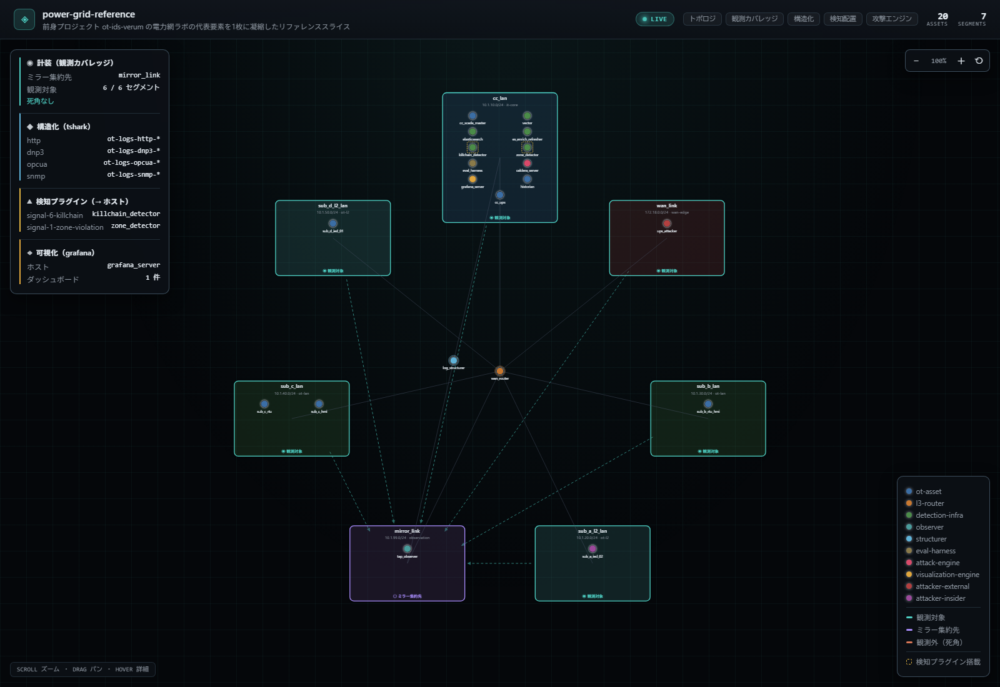
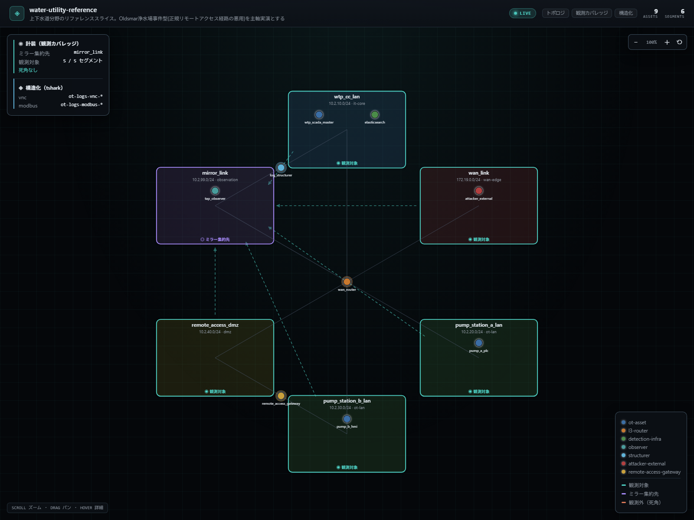
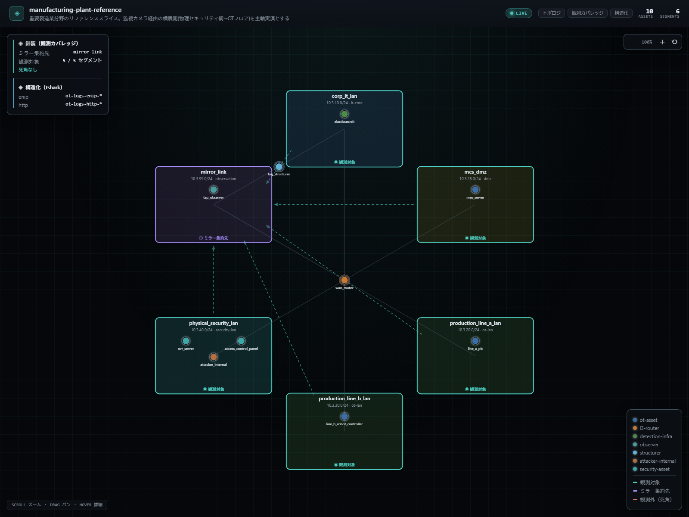
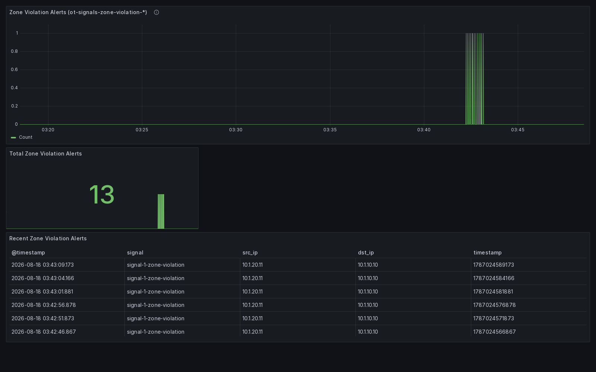

# Amenonuboco — Cyber Range as Code

-brightgreen)

> **天沼矛（あめのぬぼこ）** — マニフェスト1枚から、OT/ICS向けサイバーレンジ（攻撃対象 + 計装 + 検知パイプライン）を動的にプロビジョニングするためのプラットフォーム。

## これは何か

Infrastructure as Code がインフラ構成をコードで宣言してべき等に再現するように、**Amenonuboco は「サイバーレンジそのもの」を宣言的なマニフェストで定義し、そこから動的に環境を立ち上げる**ことを目指すプロジェクトです。このアプローチを **Cyber Range as Code (CRaC)** と呼びます。

日本神話で、天沼矛は混沌とした海原をかき混ぜて最初の島を生み出しました。「未定義の状態を、一本の矛（マニフェスト）でかき混ぜると、そこから具体的な検証環境が立ち上がる」——この由来が、プロジェクトの本質を表しています。

## 背景

本プロジェクトは、前身プロジェクト [`ot-ids-verum`](https://github.com/schutzz/ot-ids-verum)（OOB自己申告に頼らず観測事実だけでOT攻撃を検知する固定ラボ、Phase 0〜11完了）の到達点を土台にしています。

`ot-ids-verum` では「攻撃 → 解析 → 検知ロジック追加 → 効果実証」という検証サイクルを型として確立しましたが、その型を新しいプロトコル・トポロジ・シナリオに適用するたびに、環境構築の手作業（compose定義・ミラーリング設定・各種sidecar・取り込み設定の編集）が律速になっていました。

**Amenonuboco は、この環境構築そのものをマニフェストから自動生成する**ことで、検証サイクルのスケールを狙います。`ot-ids-verum` は、本プラットフォームが生成しうる環境の「リファレンス実装・検証済みテンプレート供給源」として位置づけられます。

## 設計方針

- **構造化層は tshark を既定** とする。Wireshark の広範な dissector ライブラリを、新プロトコル対応のスケールの源泉にする（プロトコルごとに自作パーサーを書くコストを避ける）。
- **プラットフォームは「構造化まで」の共通基盤に徹する**。「何を異常とするか」という検知ロジックは各シナリオ側の責務とし、プラットフォームは載せる口だけを用意する。
- **Spicy/Zeek は例外ケースのプラグイン**。パーサー自体にステートフルな検知を組み込みたい場合、高負荷時、非標準ペイロード対応が必要な場合に限って使う。
- **出力先の命名規則は前身を踏襲**（`ot-logs-<protocol>-*`）。

## マニフェストエディタ（ブラウザで試す）

マニフェストを手書きしなくても組み立てられる **[マニフェストエディタ](https://schutzz.github.io/ot-range-amenonuboco/)** を用意しています。インストール不要で、ブラウザから直接触れます。

- セグメント種別・資産ロールは選択式で、**IPがセグメントのCIDR範囲外**・**IPの重複**・**ゲートウェイのロール違い**などをその場で指摘します
- 編集すると**ネットワーク図が即座に描き直され**、観測カバレッジ（どこが死角か）が同時に見えます
- 右ペインには**生成されるYAMLが常時表示**され、そのまま `cli.py provision` に通せる形でダウンロードできます
- 15分野のリファレンス構成をテンプレートとして読み込めるので、ゼロから書き始める必要はありません（深さの違いごとに群分けして並んでいます）

エディタが扱うのは `topology` / `instrumentation` / `structuring` の3層です（検知ロジック・攻撃・ダッシュボード定義はシナリオ資産としてコードで書く領域のため、エディタの対象外です）。手元の既存マニフェストを読み込みたい場合は `python platform/cli.py gui-export <manifest.yaml>` で変換したJSONをエディタへドラッグ&ドロップしてください。書き出しは常に新しいファイル（`<name>.generated.yaml`）で、元のマニフェストを上書きすることはありません。

作る順序（セグメント → 資産 → ゲートウェイ → 観測 → 構造化）と書き出し後の手順は、エディタ画面右上の「使い方」から読めます。詳しい解説は **[エディタの使い方](./docs/gui-guide.md)** にまとめています。`gui/index.html` をローカルで直接開いても同じものが動きます（外部依存なし・オフライン可）。

## 3分野の実証（T字戦略の縦棒＝深さ）

「重要インフラ15種を広く浅く展開する」より「分野を絞って中身を濃く・複雑にする」方が Amenonuboco の有用性を強く示せると判断し、**電力・上下水道・重要製造業の3分野**を、それぞれ実際の脅威（社会的インパクトの大きい実インシデントをモデル化）に基づく攻撃シナリオまで実機で通しました。3分野とも同じ「型」——①weak/default な経路を用意する → ②攻撃者資産から実プロトコルで模擬アクセスする → ③イベント駆動で送信元/セッションを検知しログ出力する → ④tshark 構造化パイプラインで実データを裏付ける——で構築しています。

| 分野 | モデルにした実インシデント | 主軸実演 | 実プロトコル | CIAの観点 |
|---|---|---|---|---|
| 電力 | 2022年 CISA/FBI/DOE 共同注意喚起（インターネット露出UPSの悪用） | UPS管理インターフェースへの不正SNMPアクセス | SNMP（net-snmp） | 可用性 |
| 上下水道 | 2021年 Oldsmar浄水場事件 | 正規リモートアクセス経路を悪用したプロセス値改竄 | VNC（x11vnc + vncdotool） | 完全性 |
| 重要製造業 | 物理セキュリティ網とOTフロアの融合リスク | 監視カメラ網からOTフロアへの横展開 | EtherNet/IP | 機密性・境界防御 |

いずれも「それっぽい」トラフィックではなく、実際のOSS実装（net-snmp / x11vnc / socat）を使った本物のプロトコル交換です。tshark の構造化パイプラインが、SNMPのcommunity文字列や書き込み値、VNCのキーストローク内容（`vnc.key_down`）、EtherNet/IPのコマンド種別まで実データとして抽出できることを、Elasticsearchへの実書き込みで確認しています。

<table>
<tr>
<td width="33%">

**電力**（`power-grid-reference.yaml`）



</td>
<td width="33%">

**上下水道**（`water-utility-reference.yaml`）



</td>
<td width="33%">

**重要製造業**（`manufacturing-plant-reference.yaml`）



</td>
</tr>
</table>

3枚とも同じマニフェスト形式・同じレンダラーから生成された自己完結HTML図です（上のPNGはそのスクリーンショット）。分野ごとに資産構成・観測カバレッジ・構造化対象プロトコルは異なりますが、図の文法（セグメント配置・色分け・観測カバレッジのバッジ）は完全に共通しています。

実際の攻撃→検知→構造化を実データ（観測されたログ・Elasticsearchの中身）で一気通貫に示すウォークスルーは [`docs/showcase/`](./docs/showcase/) にまとめています。電力（UPS可用性攻撃）・上下水道（Oldsmar型プロセス値改竄）・重要製造業（監視カメラ経由の横展開）の3分野すべてを収録済みです。

## 15分野の器（T字戦略の横棒＝幅）

深さを3分野で示した上で、**このプラットフォームが特定分野向けの作り込みではなく、重要インフラ全般を器として生成できる**ことを示すために、15分野のリファレンスマニフェストを揃えています。

「15」は **CISA が定義する重要インフラ16分野から Information Technology を除いた15分野**です。ITは他の15分野を支える基盤であり、このプラットフォーム自身が動く土台（Docker・Elasticsearch・ネットワーク）そのものなので、対象分野として立てると自己言及的になります。数を先に決めて分野を探したのではなく、公開された分類から15が出てきています。

**すべてが同じ深さで作られているわけではありません。** そこを曖昧にしないことが、この一覧の主な目的です。

| 段階 | 何を含むか | 分野 |
|---|---|---|
| 実演あり | 攻撃の実演・検知ロジック・正解ラベルとの照合まで | 電力・上下水道・重要製造業 |
| 器のみ | トポロジ／計装／構造化の3層。実トラフィックが流れ、構造化もされる | 化学・商業施設・通信・ダム・食品農業・医療 |
| 器のみ・観測境界あり | 上記に加え、**構造的に観測できない領域を死角として明示的に持つ** | 原子力・輸送・緊急サービス・防衛産業基盤・政府施設・金融 |

### 器を「ポートを開けるだけ」にしないための部品

12分野を最小のリスナー（`python3 -m http.server 502` のようなもの）で埋めると、環境は立ち上がり、図も描かれ、テストも通るのに、**宣言した構造化層が構造化する対象を持たない**——壊れているようには見えないのに、観測すべきものが存在しない状態になります。

そこで、分野をまたいで流用できるプロトコル実装を [`protocol-images/`](./protocol-images/) に9つ用意し、器はその組み合わせで作っています。Modbus/TCP・BACnet/IP・OPC UA・DNP3・SNMP・DICOM・HL7 v2・SIP・EtherNet/IP。いずれも環境変数でサーバ役とクライアント役を切り替えられ、**対で置いて初めて実トラフィックが流れます**。

9つすべて、器に組み込む前に単体で実機確認しています——サーバとクライアントを立て、tsharkが該当プロトコルのフィールドを実際に抽出するところまで。使い方は **[プロトコル資産の使い方](./docs/protocol-assets.md)** にまとめています。

### 観測できない領域を、隠さず描く

原子力の安全保護系、鉄道の信号保安系、緊急サービスのP25無線——これらは有線ネットワークのtap/mirroringという計装層の前提と根本的に相性が悪く、無理に「観測できる」ことにすれば実機を知る人にはすぐ見破られます。

これを弱点として隠すのではなく、**機能として描いています**。死角のセグメントにはゲートウェイを接続せず、観測対象から除外する。それだけで、ネットワーク図では死角の枠色と `✕ 観測外（死角）` バッジで描かれ、ゲートウェイへのスポーク線も伸びません。

**そしてこの宣言は強制されます。** ゲートウェイが静的IPを持たないセグメントを観測対象のまま残すと、生成の時点でエラーになります。つまり「観測している」と宣言するには、実際に観測経路が存在しなければならない——**器が嘘をつけない構造**になっています。

どの分野をどこまでモデル化したか、何が確かで何が推定かは **[分野カバレッジ](./docs/sector-coverage.md)** に一覧しています（12分野のトポロジの多くは一般的な理解に基づく推定であり、その旨をラベルで明示しています）。

## リポジトリ構成（暫定）

```
ot-range-amenonuboco/
├── manifests/       サイバーレンジ定義マニフェスト（宣言的な入力、15分野）
├── protocol-images/ 分野をまたいで再利用するプロトコル実装（9種）
├── platform/        マニフェストから環境を生成するプロビジョナ本体
├── gui/             マニフェストエディタ（ビルド不要の静的サイト）
├── scenarios/       検知ロジック・攻撃・評価のシナリオ資産（マニフェスト外）
├── attack-assets/   Caldera の Ability/Adversary（マニフェスト外）
├── tests/           スキーマ・生成物・シナリオ資産のユニットテスト
└── docs/            公開ドキュメント
```

## 現在のテスト品

3枚のリファレンスマニフェスト（[`manifests/power-grid-reference.yaml`](./manifests/power-grid-reference.yaml)＝前身 `ot-ids-verum` の電力網ラボを再現・濃縮したもの、[`manifests/water-utility-reference.yaml`](./manifests/water-utility-reference.yaml)、[`manifests/manufacturing-plant-reference.yaml`](./manifests/manufacturing-plant-reference.yaml)）のいずれからも、下記3つを生成・配線できます（可視化層は現時点で電力のみ配線済み）。

1. `docker-compose.yml` — 実際に `docker compose up` でコンテナ群（電力は7セグメント・20資産）が起動し、マルチホーム資産（ゲートウェイ）を経由したクロスセグメントルーティングが機能することを実機確認済みです。マニフェストに `instrumentation` 層（観測対象セグメントの宣言、既定で全セグメントが対象になるオプトアウト方式）を加えるだけで、ゲートウェイ資産が `tc` ベースのミラーリングを自動設定し、複数セグメントを跨ぐ通信が観測ノードへ実際に届くことも実機確認済みです（送出側・受信側双方のカーネルカウンタで検証）。さらに `structuring` 層を加えると、専用ロール（`structurer`）の資産が tshark ベースの構造化パイプラインを自動起動し、ミラーされたトラフィックを Elasticsearch へバルク投入します。実際にセグメントを跨ぐ HTTP/DNP3 トラフィックを捕捉し、`ot-logs-<protocol>-*` へ書き込まれ検索可能になることまで実機確認済みです。そして `detection`／`attack` 層を加えると、検知プラグイン（sidecar）を任意の資産へ載せ、Caldera エンジンを配線します。**前身 `ot-ids-verum` の検知シナリオ（Signal 1: ゾーン逸脱検知）を、環境定義に一切手を入れずに差し込み、攻撃 → 構造化 → 検知発火 → 正解ラベルとの一致まで、縦に1本通しきることを実機で確認しました**（不正セグメントからのDNP3送信 → tsharkによる構造化 → sidecarでのアラート発火 → 独立した評価ハーネスでの正解ラベル照合、一致率100%）。
2. 防御側・統裁側向けのHTMLネットワーク図（外部ライブラリ非依存の自己完結ファイル、ズーム/パン・ノードホバーでの詳細表示に対応）：


同じマニフェストから生成されるため、実環境の構成と図が乖離しません。図が示す情報：

- **トポロジ** — セグメントを円周上の箱として配置し、複数セグメントに接続する資産（ゲートウェイ `wan_router`、構造化ノード `log_structurer`）は接続先の重心に置いてスポーク線を伸ばします。
- **観測カバレッジ** — 各セグメントの枠色と下端バッジが「観測対象／ミラー集約先／**観測外（死角）**」を示します。破線の矢印は、実際にミラーされるトラフィックの流れです。**どこが死角かを一目で示すこと**を重視しています（演習の統裁側にとっては、見えている範囲より見えていない範囲の方が重要なため）。
- **構造化・検知・可視化** — どのプロトコルがどの Elasticsearch index へ構造化されるか、どの検知プラグイン・可視化エンジンがどの資産に載っているかを左パネルに表示します。検知プラグインを載せた資産には破線の角枠、攻撃エンジン（Caldera）・可視化エンジン（Grafana）には専用色を付けます。

観測カバレッジ・検知配置の判定は図側で再実装せず、プロビジョナと同じロジックをそのまま呼んでいます。図と実環境が別々の答えを出す余地を作らないためです。

3. Grafana ダッシュボード（時系列データの可視化。ネットワーク図が「構造」を可視化するのに対し、こちらは「検知結果・トラフィック統計」を可視化する別レイヤーです）：



`visualization` 層は、Grafana server を `topology.assets` へ通常の資産として宣言し、`visualization.host` で名前参照するだけで配線が完成します。データソース（Elasticsearch）は `structuring.protocols[].output_index` と検知アラートの命名規約（`ot-signals-<signal>-*`）から**自動生成**され、ダッシュボード定義（JSON）はマニフェスト外のシナリオ資産として読み取り専用マウントされます（プラットフォームは中身を解釈しません、検知プラグインの `source` と同じ扱い）。上のスクリーンショットは、Signal 1（ゾーン逸脱検知）に対する反復攻撃（15回）で蓄積したアラートを、Grafana が実際にプロビジョニングし描画したものを headless Chrome で撮影したものです（13件のアラート発火をタイムライン上に確認できます）。

再現する場合：

```bash
cd platform
python cli.py provision ../manifests/power-grid-reference.yaml          # docker-compose.yml を生成(Grafanaの配線を含む)
python cli.py diagram   ../manifests/power-grid-reference.yaml          # ネットワーク図(HTML)を生成

# 上下水道・重要製造業も同じ2コマンドで生成できる
python cli.py provision ../manifests/water-utility-reference.yaml
python cli.py diagram   ../manifests/water-utility-reference.yaml
python cli.py provision ../manifests/manufacturing-plant-reference.yaml
python cli.py diagram   ../manifests/manufacturing-plant-reference.yaml
```

## ステータス

**15分野の器展開が完了しました。** CISA重要インフラ16分野からITを除いた15分野のリファレンスマニフェストが揃い、T字戦略の縦棒（深さ＝3分野の実演）と横棒（幅＝15分野の器）が実際に揃った状態です。

そこに至るまでの到達点：トポロジ層〜検知・攻撃層の差し込み口、前身 `ot-ids-verum` の検知シナリオ「Signal 1」の縦通し、Grafanaダッシュボードへの可視化配線、電力・上下水道・重要製造業の3分野の実演（実インシデントをモデルにした攻撃シナリオを実プロトコル——SNMP/VNC/EtherNet-IP——で実装し、攻撃者資産からのアクセス→イベント駆動の検知ログ→tshark構造化パイプラインでの実データ抽出まで実機確認）、ブラウザ完結のマニフェストエディタ。

直近では、分野をまたいで再利用できるプロトコル実装9種をコンテナ化し（いずれもtsharkによるフィールド抽出まで個別に実機確認済み）、12分野をその組み合わせで構築しました。うち6分野は、tap/mirroringの前提と相性の悪い領域を**死角として明示的に持つ器**です。

スキーマ・生成物・GUI（Python/JSのパリティを含む）・シナリオ資産をカバーする pytest スイートと GitHub Actions CI を継続して整備しています。

### 開発

```bash
pip install -r requirements-dev.txt
pytest          # スキーマ検証・生成物・記法ガイド整合・シナリオ資産のテスト
```

実機で `docker compose up` する際は、**ホスト上に本プロジェクトと無関係な Docker コンテナ・ネットワークが動いていないことを確認してください**。可視化層（Grafana等）はホストポートを固定で公開するため、別のプロジェクト・別セッションの残留コンテナが同じポート（例: `3000`）を握っていると起動に失敗します。また、無関係なコンテナが動いた状態での実機確認は、ミラーリング・構造化・検知の動作を保証しません（本プロジェクトはOT/ICSプロトコルを扱うため、他プロジェクトの残留コンテナとの予期しない相互作用を避ける意味でも、クリーンな状態での起動を推奨します）。

## ライセンス

（未定）

---

🤖 このプロジェクトは [Claude Code](https://claude.com/claude-code) を用いて開発されています。
