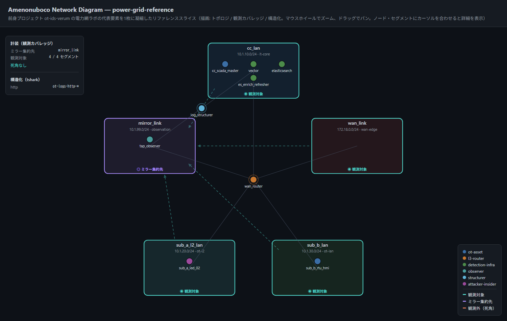

# Amenonuboco — Cyber Range as a Code

-brightgreen)

> **天沼矛（あめのぬぼこ）** — マニフェスト1枚から、OT/ICS向けサイバーレンジ（攻撃対象 + 計装 + 検知パイプライン）を動的にプロビジョニングするためのプラットフォーム。

## これは何か

Infrastructure as Code がインフラ構成をコードで宣言してべき等に再現するように、**Amenonuboco は「サイバーレンジそのもの」を宣言的なマニフェストで定義し、そこから動的に環境を立ち上げる**ことを目指すプロジェクトです。このアプローチを **Cyber Range as a Code (CRaaC)** と呼びます。

日本神話で、天沼矛は混沌とした海原をかき混ぜて最初の島を生み出しました。「未定義の状態を、一本の矛（マニフェスト）でかき混ぜると、そこから具体的な検証環境が立ち上がる」——この由来が、プロジェクトの本質を表しています。

## 背景

本プロジェクトは、前身プロジェクト [`ot-ids-verum`](https://github.com/schutzz/ot-ids-verum)（OOB自己申告に頼らず観測事実だけでOT攻撃を検知する固定ラボ、Phase 0〜11完了）の到達点を土台にしています。

`ot-ids-verum` では「攻撃 → 解析 → 検知ロジック追加 → 効果実証」という検証サイクルを型として確立しましたが、その型を新しいプロトコル・トポロジ・シナリオに適用するたびに、環境構築の手作業（compose定義・ミラーリング設定・各種sidecar・取り込み設定の編集）が律速になっていました。

**Amenonuboco は、この環境構築そのものをマニフェストから自動生成する**ことで、検証サイクルのスケールを狙います。`ot-ids-verum` は、本プラットフォームが生成しうる環境の「リファレンス実装・検証済みテンプレート供給源」として位置づけられます。

## 設計方針

- **構造化層は tshark を既定** とする。Wireshark の広範な dissector ライブラリを、新プロトコル対応のスケールの源泉にする（プロトコルごとに自作パーサーを書くコストを避ける）。
- **プラットフォームは「構造化まで」の共通基盤に徹する**。「何を異常とするか」という検知ロジックは各シナリオ側の責務とし、プラットフォームは載せる口だけを用意する。
- **Spicy/Zeek は例外ケースのプラグイン**。パーサー自体にステートフルな検知を組み込みたい場合、高負荷時、非標準ペイロード対応が必要な場合に限って使う。
- **出力先の命名規則は前身を踏襲**（`ot-logs-<protocol>-*`）。

## リポジトリ構成（暫定）

```
ot-range-amenonuboco/
├── manifests/    サイバーレンジ定義マニフェスト（宣言的な入力）
├── platform/     マニフェストから環境を生成するプロビジョナ本体
└── docs/         公開ドキュメント
```

## 現在のテスト品

マニフェスト1枚（[`manifests/power-grid-reference.yaml`](./manifests/power-grid-reference.yaml)、前身 `ot-ids-verum` の電力網ラボのトポロジを再現したリファレンススライス）から、下記2つを生成できます。

1. `docker-compose.yml` — 実際に `docker compose up` で9コンテナが起動し、マルチホーム資産（ゲートウェイ）を経由したクロスセグメントルーティングが機能することを実機確認済みです。マニフェストに `instrumentation` 層（観測対象セグメントの宣言、既定で全セグメントが対象になるオプトアウト方式）を加えるだけで、ゲートウェイ資産が `tc` ベースのミラーリングを自動設定し、複数セグメントを跨ぐ通信が観測ノードへ実際に届くことも実機確認済みです（送出側・受信側双方のカーネルカウンタで検証）。さらに `structuring` 層を加えると、専用ロール（`structurer`）の資産が tshark ベースの構造化パイプラインを自動起動し、ミラーされたトラフィックを Elasticsearch へバルク投入します。実際にセグメントを跨ぐ HTTP トラフィックを捕捉し、`ot-logs-http-*` へ書き込まれ検索可能になることまで実機確認済みです。
2. 防御側・統裁側向けのHTMLネットワーク図（外部ライブラリ非依存の自己完結ファイル、ズーム/パン・ノードホバーでの詳細表示に対応）：



同じマニフェストから生成されるため、実環境の構成と図が乖離しません。図が示す情報：

- **トポロジ** — セグメントを円周上の箱として配置し、複数セグメントに接続する資産（ゲートウェイ `wan_router`、構造化ノード `log_structurer`）は接続先の重心に置いてスポーク線を伸ばします。
- **観測カバレッジ** — 各セグメントの枠色と下端バッジが「観測対象／ミラー集約先／**観測外（死角）**」を示します。破線の矢印は、実際にミラーされるトラフィックの流れです。**どこが死角かを一目で示すこと**を重視しています（演習の統裁側にとっては、見えている範囲より見えていない範囲の方が重要なため）。
- **構造化** — どのプロトコルがどの Elasticsearch index へ構造化されるかを左パネルに表示します。

観測カバレッジの判定は図側で再実装せず、プロビジョナと同じロジックをそのまま呼んでいます。図と実環境が別々の答えを出す余地を作らないためです。

再現する場合：

```bash
cd platform
python cli.py provision ../manifests/power-grid-reference.yaml   # docker-compose.yml を生成
python cli.py diagram   ../manifests/power-grid-reference.yaml   # ネットワーク図(HTML)を生成
```

## ステータス

**Phase 3（構造化層の自動生成）完了** — トポロジ層（Phase 1）・計装層（Phase 2：ミラーリング設定の自動生成）に加え、構造化層（Phase 3：tsharkベースの構造化パイプライン＋軽量バルクローダーの自動生成）が動作しています。次はPhase 4（検知・攻撃層の差し込み口）に着手予定です。

## ライセンス

（未定）

---

🤖 このプロジェクトは [Claude Code](https://claude.com/claude-code) を用いて開発されています。
