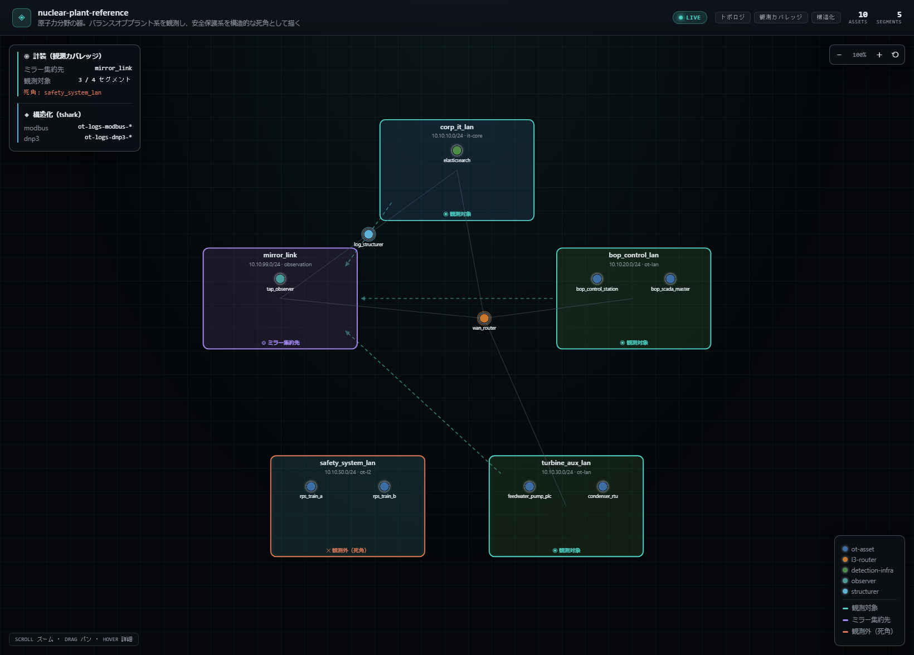
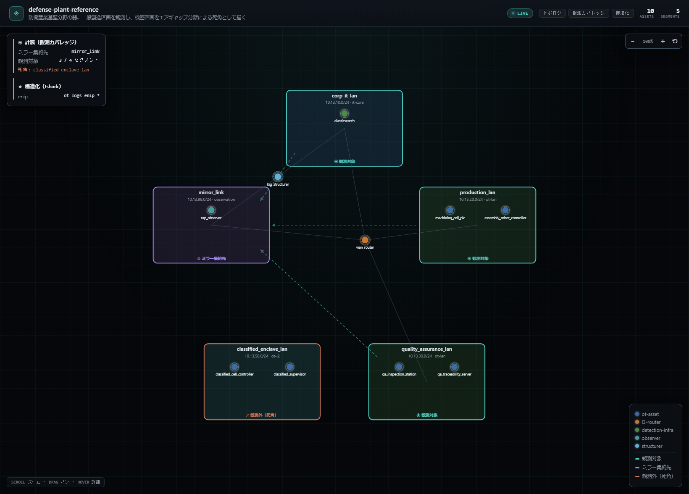
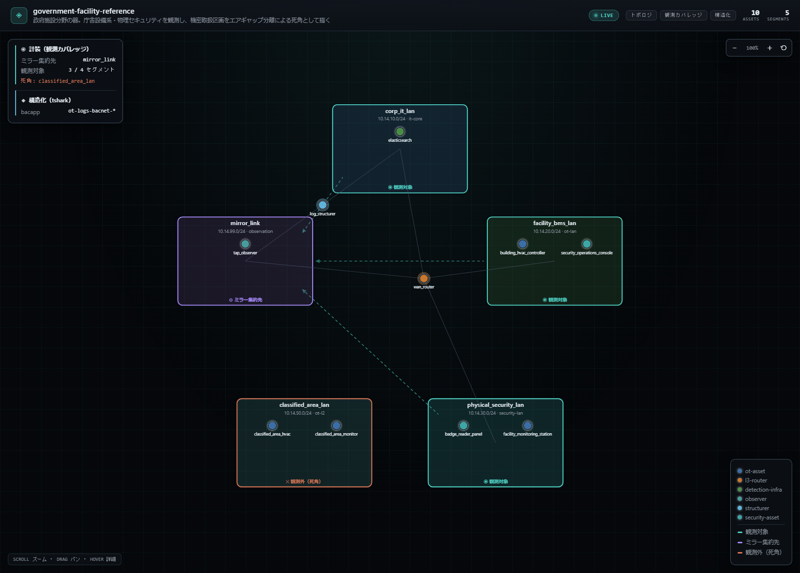

# 分野カバレッジ

`manifests/` には15分野のリファレンスマニフェストがあります。この文書は、**どの分野をどこまでモデル化したか**と、**何が確かで何が推定か**を一覧にしたものです。

---

## 「15」という数字の根拠

CISA が定義する重要インフラ **16分野**から、**Information Technology を除いた15分野**です。

ITは他の15分野を支える基盤であり、このプラットフォーム自身が動く土台（Docker・Elasticsearch・ネットワーク）そのものです。レンジの対象分野として立てると自己言及的になるため外しています。

数を先に決めて分野を探したのではなく、公開された分類から15が出てきています。

---

## 深さは3段階に分かれます

**すべての分野が同じ深さで作られているわけではありません。** ここを曖昧にしないことが、この一覧の主な目的です。

| 段階 | 何を含むか | 分野数 |
|---|---|---|
| **実演あり** | topology / instrumentation / structuring に加え、**実インシデントをモデルにした攻撃の実演・検知ロジック・正解ラベルとの照合** | 3 |
| **器のみ** | topology / instrumentation / structuring の3層。実トラフィックは流れ、構造化もされるが、攻撃・検知は含まない | 6 |
| **器のみ・観測境界あり** | 上記に加え、**構造的に観測できない領域を死角として明示的に持つ** | 6 |

---

## 根拠と確度のラベル

| 記号 | 意味 |
|---|---|
| ✅ | 公開情報で裏取り済み（実インシデント・公的勧告・規格） |
| 🔶 | 一次知識ベースの推定。個別の裏取りは未実施 |
| ⚠️ | 要検証 |

**12分野のほとんどは 🔶 です。** これらのトポロジは「その分野ならこういう構成だろう」という一般的な理解に基づいて組んだもので、特定の実在システムを調査してモデル化したものではありません。隠さずラベルで示しています。

---

## 一覧

### 実演あり（3分野）

| ファイル | 分野（CISA） | 主要プロトコル | 実演の内容 | 確度 |
|---|---|---|---|---|
| `power-grid-reference.yaml` | Energy | SNMP, DNP3, HTTP | UPS管理インターフェースへの可用性攻撃。初期設定のまま露出したSNMPエージェントに対するSET試行を、送信元ベースで検知する | ✅ |
| `water-utility-reference.yaml` | Water and Wastewater Systems | VNC, HTTP | 正規のリモート保守経路を経由した侵入。キーストローク内容まで構造化して裏付ける | ✅ |
| `manufacturing-plant-reference.yaml` | Critical Manufacturing | EtherNet/IP, HTTP | 物理セキュリティ網（監視カメラ）からOTフロアへの横展開 | ✅ |

### 器のみ（6分野）

| ファイル | 分野（CISA） | 主要プロトコル | トポロジの骨子 | 確度 |
|---|---|---|---|---|
| `chemical-plant-reference.yaml` | Chemical | Modbus/TCP, OPC UA | バッチプラント。反応器PLCと温度制御ループを現場計装層に置き、DCS・バッチ制御ステーション・ヒストリアンが上位から読み書きする | 🔶 |
| `building-automation-reference.yaml` | Commercial Facilities | BACnet/IP | 商業ビル。空調・照明・入退室がいずれもBACnetで同じ網に載る。**用途の異なる系統がプロトコルで区別されない**構成 | 🔶 |
| `telecom-core-reference.yaml` | Communications | SNMP, SIP | 通信事業者網。装置の管理平面（SNMP）と加入者のサービス平面（SIP）という、性質の異なる2つの平面が重なる | 🔶 |
| `dam-control-reference.yaml` | Dams | Modbus/TCP, DNP3 | 治水ダム。現地のゲート制御（Modbus）と遠隔監視所からの水位収集（DNP3）を使い分ける | 🔶 |
| `food-processing-reference.yaml` | Food and Agriculture | Modbus/TCP, OPC UA | 食品工場。充填ライン・冷蔵倉庫・CIP洗浄。**止まることより気づかれずにずれることの方が深刻**な種類のプロセス値が流れる | 🔶 |
| `hospital-network-reference.yaml` | Healthcare and Public Health | DICOM, HL7 v2 | 病院。画像系（モダリティ→PACS）と診療情報系（生体モニタ・検査装置→電子カルテ）。**患者情報が平文で流れる**（データはすべて合成） | 🔶 |

### 器のみ・観測境界あり（6分野）

死角の理由は分野ごとに異なります。同じ「見えない」でも成り立ちが違うことが、この6枚の主張です。

| ファイル | 分野（CISA） | 観測できる領域 | 死角にした領域 | 死角の理由 | 確度 |
|---|---|---|---|---|---|
| `nuclear-plant-reference.yaml` | Nuclear Reactors, Materials, and Waste | バランスオブプラント系・タービン補機系（Modbus, DNP3） | 安全保護系 | **物理的な分離**。独立・多重化された専用系であり、有線ネットワークのtap/mirroringという前提が成り立たない | 🔶 |
| `rail-transit-reference.yaml` | Transportation Systems | 駅務設備（BACnet）・旅客案内（SNMP） | 信号保安系（CBTC等） | **取れても読めない**。標準化されたオープンプロトコルに乏しく、解析ツールにdissectorが存在しない | 🔶 |
| `emergency-dispatch-reference.yaml` | Emergency Services | 指令台の音声呼（SIP）・無線ゲートウェイの管理面（SNMP） | P25デジタル無線 | **伝送媒体が有線でない**。無線を観測するには全く別の装置が要る | 🔶 |
| `defense-plant-reference.yaml` | Defense Industrial Base | 製造系・品質保証系（EtherNet/IP） | 機密区画 | **制度的なエアギャップ**。技術的制約ではなく取り扱い区分によって観測の可否が決まる | 🔶 |
| `government-facility-reference.yaml` | Government Facilities | 庁舎設備（BACnet）・物理セキュリティ | 機密取扱区画 | 同上。**同じ建物・同じ設備でも、区画が違えば観測できない** | 🔶 |
| `financial-datacenter-reference.yaml` | Financial Services | データセンター設備（BACnet, SNMP） | 決済ネットワーク | **専用線・独自フレーミングで分離**。設備側の観測系からは到達も解釈もできない。15分野の中で最もOTとして見える範囲が狭い | 🔶 |

---

## 観測境界はどう表現されているか

死角は特別な記法で書くものではありません。**既存の仕組みだけで表現されています。**

1. 観測できないセグメントには、**ゲートウェイを接続しない**（エアギャップの表現そのもの）
2. そのセグメントを `instrumentation.exclude` に入れる

これだけで、ネットワーク図では死角の枠色と `✕ 観測外（死角）` バッジで描かれ、ゲートウェイへのスポーク線も伸びません。

**そしてこの宣言は強制されます。** ゲートウェイが静的IPを持たないセグメントを観測対象のまま残すと、生成の時点でエラーになります。つまり**「観測している」と宣言するには、実際に観測経路が存在しなければなりません**。器が嘘をつけない構造になっています。

死角のセグメントにも資産は配置してあります。そこに何があるかは図に出ますが、ゲートウェイからの経路が無いため到達も観測もできません。**「何があるかは分かっているが、そこで何が起きているかは見えない」**——統裁側にとって最も重要な状態を、器としてそのまま表現しています。

死角の中に置いた資産のプロトコルは**代役**です。実際の安全保護系やP25や決済網の仕様を騙らないための選択で、死角の中ではどのプロトコルであるかは観測結果に一切影響しません。

### 6分野すべての図

死角の理由が分野ごとに異なることは、表だけでなく実際の図で見比べるとより分かりやすくなります。すべて `platform/cli.py diagram` が生成した自己完結HTMLをそのままスクリーンショットしたものです。オレンジ枠＋`✕ 観測外（死角）`が死角セグメント、ティール枠＋`◎ 観測対象`が観測できるセグメントです。

**原子力**（死角の理由：物理的な分離）

**輸送**（死角の理由：dissector不在）

**緊急サービス**（死角の理由：伝送媒体が無線）

**防衛産業基盤**（死角の理由：制度的なエアギャップ）

**政府施設**（死角の理由：同上、機密取扱区画）

**金融**（死角の理由：専用線での分離）

6枚を並べると、死角セグメント（`✕ 観測外（死角）`、オレンジ枠）へゲートウェイからのスポーク線が一本も伸びていないこと、`instrumentation` パネルの「観測対象 3 / 4 セグメント」という数字と「死角: ＜セグメント名＞」という表示が全分野で一貫していることが分かります。トポロジの骨格（`corp_it_lan` → `wan_router` → 各セグメント、`mirror_link` への破線）は共通のレンダラーが描いたもので、分野ごとに変えているのはセグメント名・資産名・死角の対象だけです。

---

## 関連

- [プロトコル資産の使い方](protocol-assets.md) — 各分野の資産の中身になっているプロトコル実装
- [マニフェスト記法ガイド](manifest-schema-guide.md) — マニフェストそのものの書き方
